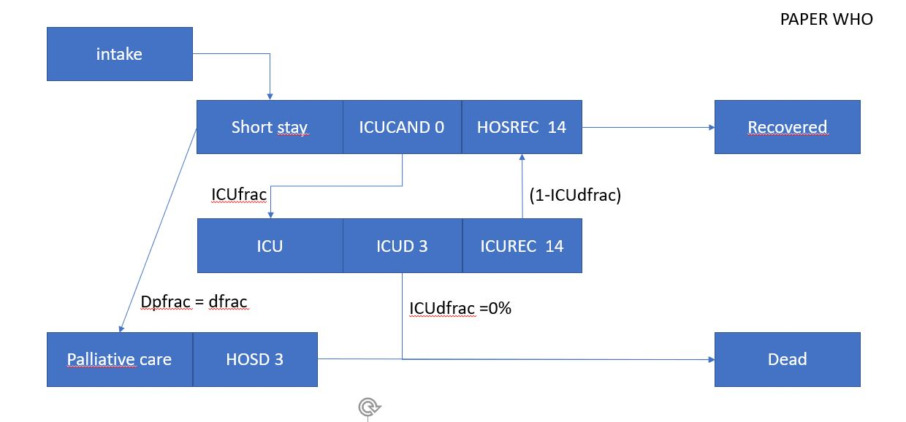

# Running

for further information on this code and referencing to this code:

The method is submitted to WHO bulletin and online available (under review):

Forecasting hospitalization and ICU rates of the COVID-19 outbreak: an efficient SEIR model

Jan-Diederik van Wees, Sander Osinga, Martijn van der Kuip, Michael Tanck, Maurice Hanegraaf
Maarten Pluymaekers, Olwijn Leeuwenburgh, Lonneke van Bijsterveldt, Jaap Zindler, Marceline Tutu van Furth


https://www.who.int/bulletin/online_first/covid-19/en/
http://dx.doi.org/10.2471/BLT.20.256743

The program has been tested under python 3.7


To run a calibration and forecast:

1. Create a .json configuration file. Several example files are provided in this repository in the configs directory
    china.json
    korea.json
    lombardy_mc.json
    netherlands_actual.json
    netherlands_march14.json
    netherlands_march21.json
    netherlands_march26.json

2. run  corona_mc.py (for the loglikelyhood mode)  or corona_esmda.py (for the ensemble smoother model)
from the bin directory as working directory, so the settings (e.g. in pycharm should be as displayed in the figure below).
After running esmda you can run confidencecurves.py to generate colored plots displaying expected mean, and confidence intervals for ICU,
hospitalized cum, hospitalized and mortalities. For all a zoom close to the actual end of the observation data and a
plot over the selected axis range (controlled by XMAX and YMAX)
```
For corona_mc.py
  script path: {your git corona dir}/bin/corona_mc.py
  parameters: {your git corona dir}../configs/netherlands_march26.json
  working directory {your git corona dir}/bin
For corona_esmda.py
  script path: {your git corona dir}/bin/corona_mc.py
  parameters: {your git corona dir}../configs/netherlands_march26.json
  working directory {your git corona dir}/bin
For confidencecurves.py
  script path: {your git corona dir}/bin/confidencecurves.py
  parameters: {your git corona dir}../configs/netherlands_march26.json
  working directory {your git corona dir}/bin
```
 

3. formats of input and meaning of parameters

China.json :
```
{
  "worldfile": true,   #  USE John Hopkins  repository for data
  "country": "China",  # name of country in repository or datafile,
  "province": "all",  # name of "province": use all
   "maxrecords": 60,  # maximum number of days for the data to take into account from the first record onward
  "t_max" : 90,       # maximum range of the model including the time_delay
  "dt" : 0.1,         # dt for ODE solver (days), default=0.1 days
  "time_delay": 17,   # time before first data (in days) where the SEIR model starts
  "population": 16e6,  # population size used to scale the results of the SEIR model
  "nr_prior_samples": 400,   # for corona_mc.py prior number of samples for MC, for ESMDA number of ensembles
  "nr_forecast_samples": 500, # for corona_mc.py only,  number of samples for MC  with alfa variation, based on best fit
  "esmda_iterations": 16,  # corona_esmda.oy  only, number of iterations for multiple data assimilation
  "N" : {                    # initial seed of exposed persons 1/N at start of the model run, here uniform distribution
        "type": "uniform",
      "min":  25000,
      "max":  250000
    },
  "sigma" : 0.2,    # sigma of SEIR model
  "gamma" : 0.5,     # gamma of SEIR model
  "R0" : {              # R0 of SEIR, here uniform distribution
    "type": "uniform",
    "min": 3.3,
    "max": 3.7
  },
  "m": 0.9,     # fraction population susceptible
  "alpha" : [[0.35,0.55], [0.7,1.0],[0.9,0.95]], # 3 alfa phases starting at dayalpha, each with uniform uncertainty range
        # in corona_mc.py these are varied without calibration starting from best fit curve to data
        # in corona_esmda.py these are fit to data
  "dayalpha" : [1, 7, 20], # days at which alfa starts
  "hosfrac" : 0.17,       # relative fraction of infected people hospitalized, default 0.05 but higher for china to
                          # to compare infected with observed
```
  *For the times to move from Removed in the SEIR model to recover or  die, we used in the WHO paper very simple settings for the hospital flow, resulting in an average stay of ICU patients of 14 days. In the mean time we improved the flow parameters as depicted  below. In order to be in agreement with the WHO paper, below we show settings in accordance with the average stay. The ICUdfrac has been set artificilly to 0.0 to obtain results which are very similar to the WHO paper results.  Evidently the flow diagram allows realistic settings in accordance with country specific or time dependent measures*
  
  
```
  "delayHOS" : 5,          # delay between recovered and hospitalization (days)
  "delayHOSREC" : 14,      # average time for recovery of hopsitalized patients not in need for ICU
  "delayHOSD" : 3,        # average time for death of hopsitalized patients not in need for ICU
  "delayREC" : 12,         # average time for recovery of non hopsitalized patients
  "delayICUCAND": 0,     # average time for hopsitalized patients to move to ICU
  "delayICUD": 3,        # average time for ICU patients to die
  "delayICUREC": 14,       # average time for ICU patients to recover
  "dfrac" : 0.22,         # hospitalization case fatality rate
  "icudfrac" : 0.5,         # fraction of ICU patients dying
  "calibration_mode": "dead",  # calibration on "dead"
  "observation_error": 200,    # standard error for esmda in corona_esmda.py
  "YMAX": 1e6,              # y axis plotting range (population, scaled for ICU and hospitalization plots)
  "XMAX": 60,               # x axis plottting range (days)
  "ICufrac": 0.0,           # fraction of hospitalized patients in need for ICU
   "p_values": [0.05, 0.3, 0.5, 0.7, 0.95],  # P ranges for confidence data (for csv files)
  "plot" : {                       # plot settings
    "legendloc" : "best",
    "legendfont" : "x-small",
    "y_axis_log": true,
    "hindcast_plume": false        # show all prior monte carlo samples in the hindcast plot of corona_mc.py
    "xmaxalpha": 31,               # for confidencecurves.py  output
     "casename": "China"     # for confidencecurves.py  output in esdma 
  },
  "hist_time_steps": [30,35,40,50,60] # histogram days

}
```
4 . own input files:

    In the Netherlands input file, cusroim data is loaded including information on hospitalization, The files should be a txt file as corona_dataNL26.txt with  6 columns
``` 
    #  column 0 -  day (number starting from 1)
    #  column 1 - cumulative registered infected (postive test cases)
    #  column 2  - cum  dead
    #  column 3 - cum recovered
    #  column 4 - cumulative hospitalized
    #  column 5 - actual IC units used (may be estimated or 0)
    #  column 6 - actual hospilatized (put all to 0 to overwrite from estimates calculated from the hospital flow model)
```
5 . output files

corona_mc/esmda will create several plots and a datafile in csv format in the output directory.

Output file names start with the json name and corona_mc.py
generates hindcast and forecast  (shown in paper appendix, and fig. 3) as well as ensemble plots.data
corona_esmda generates prior and posterior ensembles of dead, hospitalized, etc

The csv file can be used for further post_processing, containing confidence intervals, which can be plotted with running
confidencecurves.py

6 . errors
If a config keyword is misspelled or missing this easily results in an error, please provide all keywords.
if output writing gives an error make sure your you working directory is located at bin
